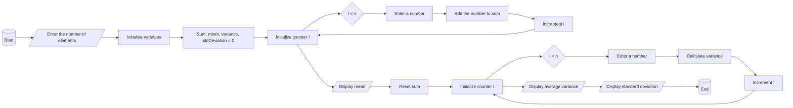

```mermaid

graph LR
A[(Start)] --> B[/Enter the number of elements/]
B --> C[Initialize variables]
C --> D[Sum, mean, variance, stdDeviation = 0]
D --> E[Initialize counter I]
E --> F{I < n}
F --> G[Enter a number]
G --> H[Add the number to sum]
H --> I[Increment i]
I --> E
E --> J[/Display mean/]
J --> K[Reset sum]
K --> L[Initialize counter I]
L --> M{I < n}
M --> N[Enter a number]
N --> O[Calculate variance]
O --> P[Increment I]
P --> L
L --> Q[/Display average variance/]
Q --> R[/Display standard deviation/]
R --> S[(End)]


``` 
