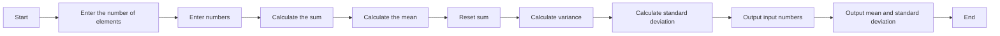

```mermaid
graph LR
A[Start] --> B[Enter the number of elements]
B --> C[Enter numbers]
C --> D[Calculate the sum]
D --> E[Calculate the mean]
E --> F[Reset sum]
F --> G[Calculate variance]
G --> H[Calculate standard deviation]
H --> I[Output input numbers]
I --> J[Output mean and standard deviation]
J --> K[End]

```
